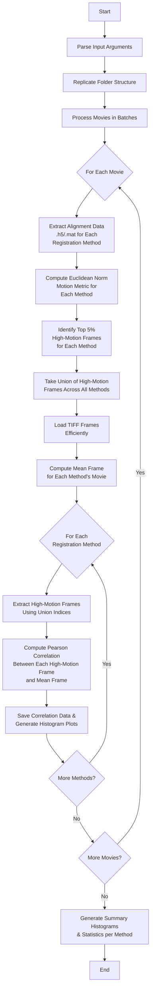

# iGluSnFR-In-Vivo-MC-Evaluation

This capsule is designed to process and analyze motion data from in-vivo data registered using various registration methods (StripRegistration, Caiman, and suite2p). It handles both .h5 and .mat files, computing Euclidean norms and identifying high-motion frames. The code also calculates Pearson correlations between mean image and high-motion frames, saving these correlations and visualizations for further analysis. 

# Code execution
- Just run ```code/run.sh``` to execute ```code/run_capsule.py``` script.

- If you want to change the dataset please change the path under:
https://github.com/AllenNeuralDynamics/iGluSnFR-In-Vivo-MC-Evaluation/blob/26af0f18a0c6215a1784f4202ddff96a9d9467c6/code/run#L4

> [!WARNING]
> Based on the resources you have available, you may want to adjust `batch_size` under https://github.com/AllenNeuralDynamics/iGluSnFR-In-Vivo-MC-Evaluation/blob/26af0f18a0c6215a1784f4202ddff96a9d9467c6/code/run_capsule.py#L116

- To skip any particular motion correction method, you can comment that one out:
https://github.com/AllenNeuralDynamics/iGluSnFR-In-Vivo-MC-Evaluation/blob/26af0f18a0c6215a1784f4202ddff96a9d9467c6/code/run_capsule.py#L232-L237

# Output structure:
```
output_folder/
├── suite2p/
│   ├── movie_index/
│   │   ├── correlations.json 
│   │   └── correlation_histogram.png
│   ├── summary_correlation_histogram.png # Accross all movies for suite2p
│   └── mean_correlation.txt # Across all movies for suite2p
├── caiman_stripCaiman/
│   └── ...
├── stripRegisteration_matlab/
│   └── ...
└── stripRegisteration/
    └── ...
```

# Flowchat:

